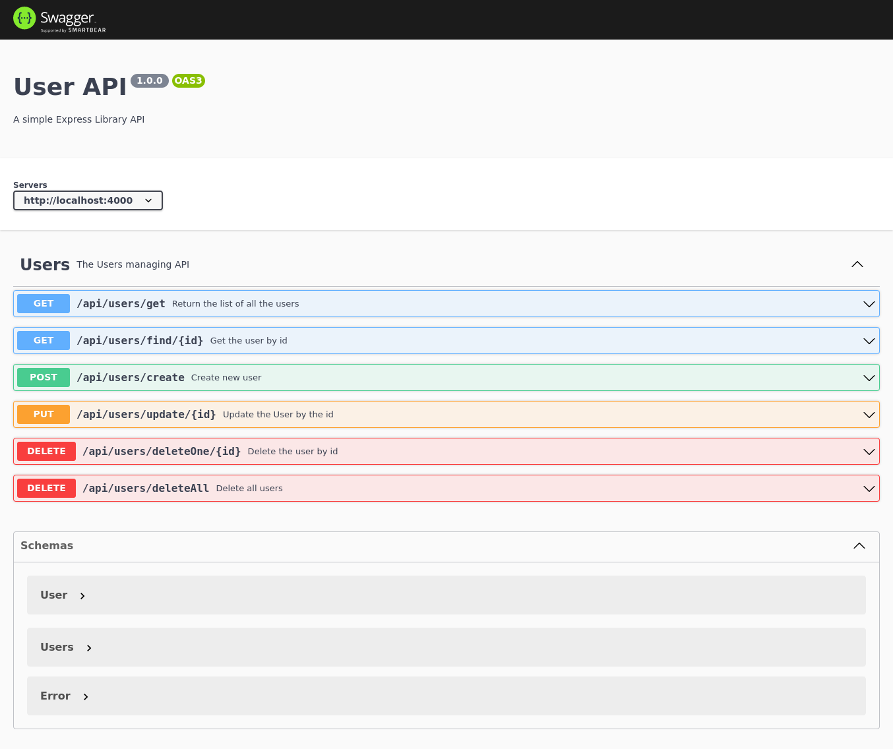

# nodejs-express-mysql-api

## To run the application

> Make sure you are in - mernStack-file-upload/ directory & type the following command on your termianl to run backend side of the project :
```
1. cd nodejs-express-mysql-api/
2. npm install
3. npm start
4. open chrome or fire fox
5. enter the adress localhost:4000/api-docs
```
## Screenshots
